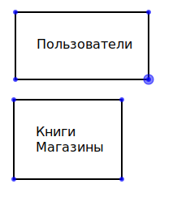
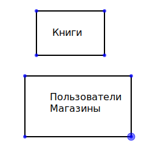
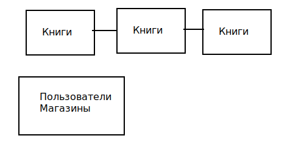
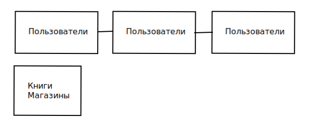

# Домашнее задание к занятию 12.7 "Репликация и масштабирование. Часть 2"
Домашнее задание выполните в Google Docs и отправьте в личном кабинете на проверку ссылку на ваш документ.

Название файла должно содержать номер лекции и фамилию студента. Пример названия: "12.7 "Репликация и масштабирование. Часть 2 - Вячеслав Рыжиков"

Перед тем как выслать ссылку, убедитесь, что ее содержимое не является приватным (открыто на просмотр всем, у кого есть ссылка). Если необходимо прикрепить дополнительные ссылки, просто добавьте их в свой Google Docs.

Любые вопросы по решению задач задавайте в чате учебной группы.

---

### Задание 1.

Опишите основные преимущества использования масштабирования методами:

- активный master-сервер и пассивный репликационный slave-сервер, 
	
```
	- копия БД спасает в случае выхода из строя мастера
	- повышение производительности, если настроить мастер на запись, слэйв на чтение
```
	
- master-сервер и несколько slave-серверов, 

```
	- возможность подключить еще больше клиентов на чтение БД за счет нескольких slave
```
	
- активный сервер со специальным механизмом репликации – distributed replicated block device (DRBD), 

```
	-Совместно используемые ресурсы хранения особенно чувствительны к ситуациям «разделенного мозга», когда различные узлы кластера все еще работают, но потеряли все сетевые соединения между собой. В таком сценарии каждый узел в кластере будет считать себя единственным живым узлом в кластере и возьмет на себя управление всеми ресурсами кластера. Это может привести к потенциально катастрофическим результатам, когда разные узлы, например, монтируют и записывают в файловую систему одновременно. Поэтому администраторы кластера должны тщательно реализовывать политики закрытия узлов, чтобы избежать этого. DRBD значительно решает эту проблему, сохраняя два набора реплицированных данных вместо одного общего набора.
```

- SAN-кластер.

```
	- Чрезвычайно быстрый доступ к данным
 	- Выделенная сеть для хранения данных снимает нагрузку на локальную сеть
 	- Высоко расширяемый
 	- Уровень ОС (уровень блока) доступ к файлам
  	- Высокое качество обслуживания для требовательных приложений, таких как редактирование видео
```	


### Задание 2.


Разработайте план для выполнения горизонтального и вертикального шаринга базы данных. База данных состоит из трех таблиц: 

- пользователи,
- книги, 
- магазины (столбцы произвольно).

Опишите принципы построения системы и их разграничение или (и) разбивку между базами данных.

*Пришлите блок схему, где и что будет располагатся. Опишите, в каких режимах будут работать сервера.* 

```
- пользователи,
	-id
	-login
	-pass
	-name
	-surname
	-age
	-id_book
- книги, 

	-id
	-title
	-year
	-author
	-pages
	-format
	-notes
	
- магазины (столбцы произвольно).
	-id
	-address
```	

Можно применить вертикальный шардинг - выделить наиболее крупную таблицу: пользователи или книги:
```




```
Также крупную таблицу можно разделить горизонтально:

Книги - по году, по автору, по названию
```


```
Пользователи - 1 таблица - id, login, pass, id_book
		2 таблица - name, surname, age
```

 


## Дополнительные задания (со звездочкой*)

Эти задания дополнительные (не обязательные к выполнению) и никак не повлияют на получение вами зачета по этому домашнему заданию. Вы можете их выполнить, если хотите глубже и/или шире разобраться в материале.

---
### Задание 3*.

Выполните настройку выбранных методов шардинга из задания 2.

*Пришлите конфиг docker и sql скрипт с командами для базы данных*
